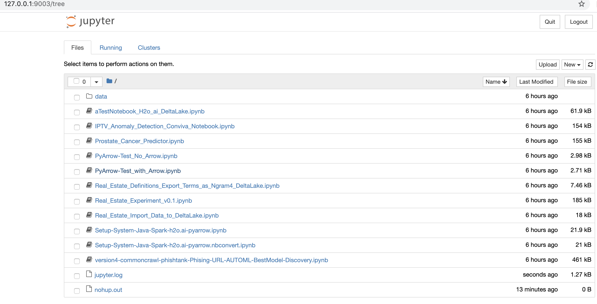

# Project lost_saturn 

   An setup with Jupyter Spark AutoML h2o.ai and client libraries Delta.io, PyArrow and Kafka
   Ideal to use Jupyter and tools exploring data in environments
   Docker (Ubunto 18.04 LTS) or Windows10 WSL (Windows Subsystem Linux)

   Setup Options
=========

   Option 1
===
     Run using Docker Desktop in your Laptop

       ./install-container.sh

   Option 2
=== 
   Run with Docker the container registred in [repo datascience-fullstack](https://hub.docker.com/r/jpacerqueira83/datascience-fullstack-vm1)
        

     Consume and run docker container with iptable port opening process

        ~ mac-u$ docker run  -it -p 9003:9003 -p 54321:54321 --cap-add=NET_ADMIN --name lost_saturn  jpacerqueira83/datascience-fullstack-vm1:latest

        
     Run Docker exec to start Jupyter after setup above finishes

        ~ mac-u$ docker exec -it lost_saturn /bin/bash -c "cd ;$HOME/anaconda3/bin/activate jupyter ;  bash -x library_tools/install-jupyter-support-packs.sh ; sleep 1 ; bash -x start-jupyter.sh ; sleep 4 ; cat notebooks/jupyter.log ; sleep infinity"

   Option 3
===
   Run setup in Windows 10 with WSL app Ubunto 18.04 LTS 

     Consume package 

        ~ wsl-u$  cd ; git clone https://github.com/jpacerqueira/project_lost_saturn.git

     Execute installation
        ~ wsl-u$  cd ; cp project_lost_saturn/library_tools/*.sh . ; bash -x anaconda_setup.sh

   

   Issues and Workarrounds 
=========

     It is recommended to use JAVA8(Oracle) or OpenJDK8 and not OpenJDK11
        Installation : https://www.linuxuprising.com/2019/02/install-any-oracle-java-jdk-version-in.html
        This installation resolve my issue here : https://github.com/jupyter/jupyter/issues/248    
    
     Mount Additional driver in Docker Containers
         Your local container may require to mount large files like Oracle JAVA installer

   Licensing
=========
  Our "lost_saturn" docker container with jupyter SparkML and AutoML Ho2.ai is licensed under the Apache License, Version 2.0. See
  [LICENSE](https://github.com/jpacerqueira/Jupyter_Spark_H2O_Kafka_Client_Setup/blob/master/README.md) for the full license text.
 
  Apache Spark, Apache Arrow, H2o.ai.jar and Open-JDK8 are licensed under the Apache 2.0 License . Python, PyArrow and pi py H2o.ai under the GNU GPL License
           
  The end product here would benefit for an DevOps engineer with experience in docker-compose    
    
  If you are a DataScience expert use as it is, improve it, fix it, share it back!

